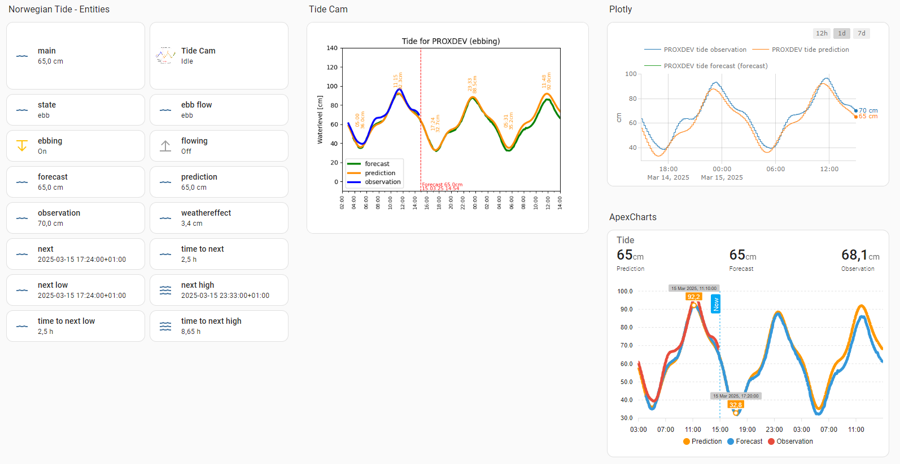

# Norwegian Tide

[![Buy Me A Coffee][buymeacoffee-image]][buymeacoffee-url]
 

This is a Home Assistant custom integration for Norwegian Tide which is interfacing an open API by the [Norwegian Mapping Authority (Kartverket)](https://kartverket.no/en/), more precisely [sehavniva.no](http://www.sehavniva.no/) which provides information about water levels and tidal predicitions and forecasts. **All data is copright [Norwegian Mapping Authority (Kartverket)](https://kartverket.no/en/)**.

Unfortunately the service only provides data for geographical positions in Norway - this is a limitation in the API and not in this integration.

## Installation
[HACS](https://hacs.xyz/) is by far the easiest way to install and stay updated for this custom integrationg. This is highly recommended. The installation is currently not included in HACS as a default repo, and must be installed through HACS *by adding this repo as a custom repository*:

1. Make sure you have [HACS](https://hacs.xyz/) installed in your Home Assistant environment.
2. Go to **HACS**, select **Integrations**.
3. Click on the three dots in the upper right corner and select **Custom repositories**
4. Copy/paste the **URL for this repo** `https://github.com/tmjo/ha-norwegiantide` into the URL-field, select **Integration as category** and then click **Add**.
5. You should now find the **Norwegian Tide** integration by searching for it in HACS, proceed to install it.
6. Restart Home Assistant (a warning should be shown in log saying you're using a custom integration).
7. Continue to the Configuration-section.

For manual installation wihtout using HACS you may either copy the `norwegian-tide` folder to your `custom_components` folder or you may install it with git. In these cases, no further details are provided as your are expected to know what you are doing. A restart of HA is required after making the changes.

## Configuration
After installation, your must configure the integration in HA. Configuration is done through UI/Lovelace. In Home Assistant, click on Settings > Devices & Services > Integrations where you add it with the + icon.

You will be asked to give your location a name and to provide latitude and longitude as geographical position for the location you want to track (your HA location is default). Finally select which sensors you would like the integration to add. There are a lot of detailed sensors, including a camera entity with an image created by Matplotlib. 

Entities can be added and removed by clicking *Options* in HA integration view at any time. It is also possible to enable more than one location by adding several devices.

## Usage
Use the integration as you please, but I highly recommend to take a look at the [Apexchart-card](https://github.com/RomRider/apexcharts-card) by Romrider or [Plotly-card](https://github.com/dbuezas/lovelace-plotly-graph-card) by dbuezas - they are both excellent graph cards for lovelace which also enables the possibility to show future values. This is necessary to display prediction- and forecast values which are stored as attributes in the main sensor. Example:

The camera entity can also be used for UI since it provides a nice plot using Matplotlib, but I personally prefer one of the graph cards since they provide more dynamics. The camera on the other hand can be handy if you would like to send notifications with an included forecast image/plot. It will look something like this:

If you are curious about specific details and definitions, please see [www.sehavniva.no](http://www.sehavniva.no/). A brief summary:
 - Prediction: A calculated prediction for the location
 - Forecast: Includes the weather effect on top of the prediction
 - Observation: The observed value on the closest station to your location

The main sensor will keep the current forecast value as state and will contain all or most data as attributes. The other entities will contain more specific data according to their name.

## Issues and development
Please report issues on github. If you would like to contribute to development, please do so through PRs.

## License
MIT © [Tor Magne Johannessen][tmjo]. **All data is copyright [Norwegian Mapping Authority (Kartverket)](https://kartverket.no/en/)**.

<!-- Badges -->
[hacs-url]: https://github.com/custom-components/hacs
[hacs-image]: https://img.shields.io/badge/HACS-Custom-orange.svg
[buymeacoffee-url]: https://www.buymeacoffee.com/tmjo
[buymeacoffee-image]: https://img.shields.io/badge/support-buymeacoffee-222222.svg?style=flat-square
[tmjo]: https://github.com/tmjo
